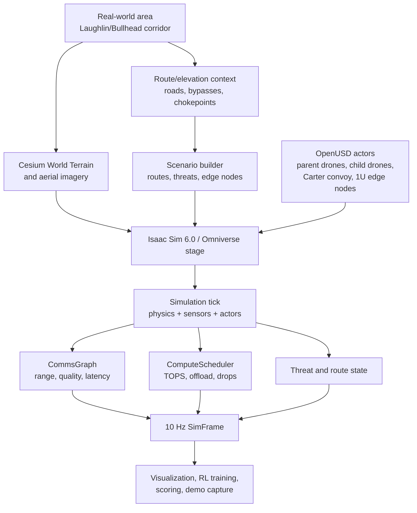
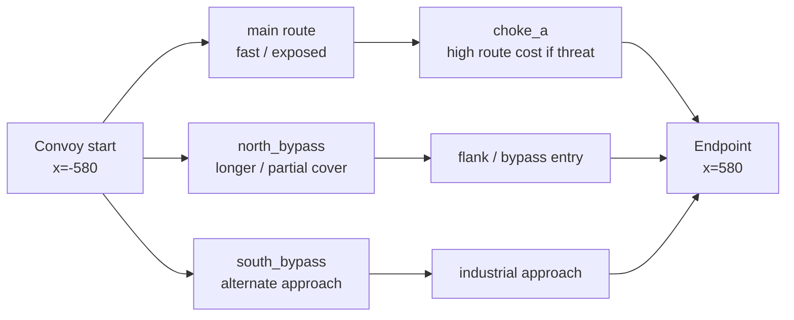
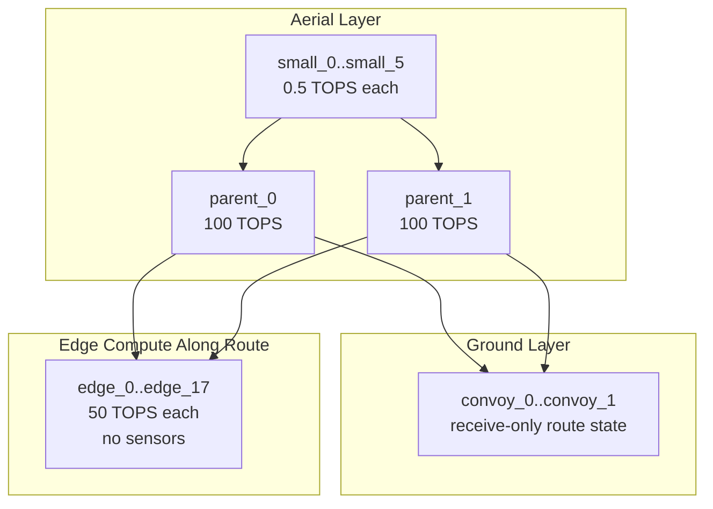
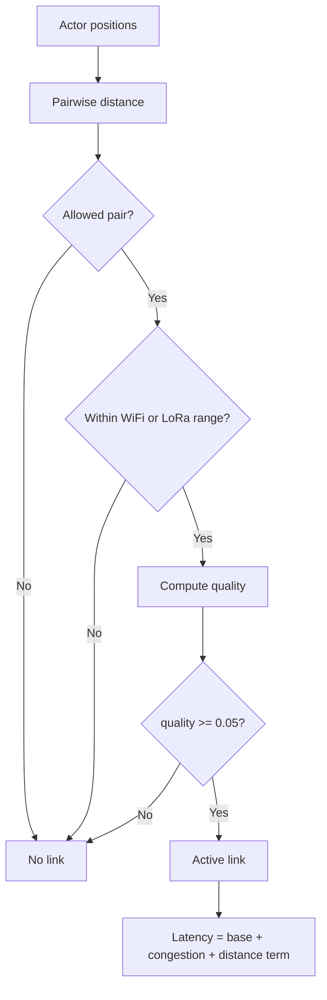
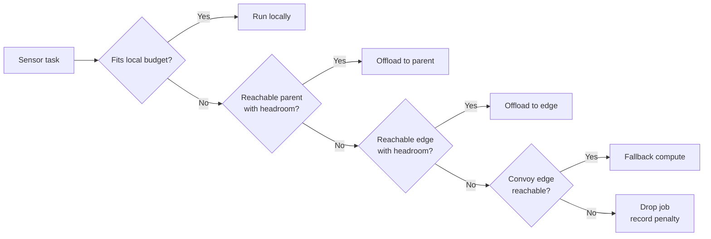
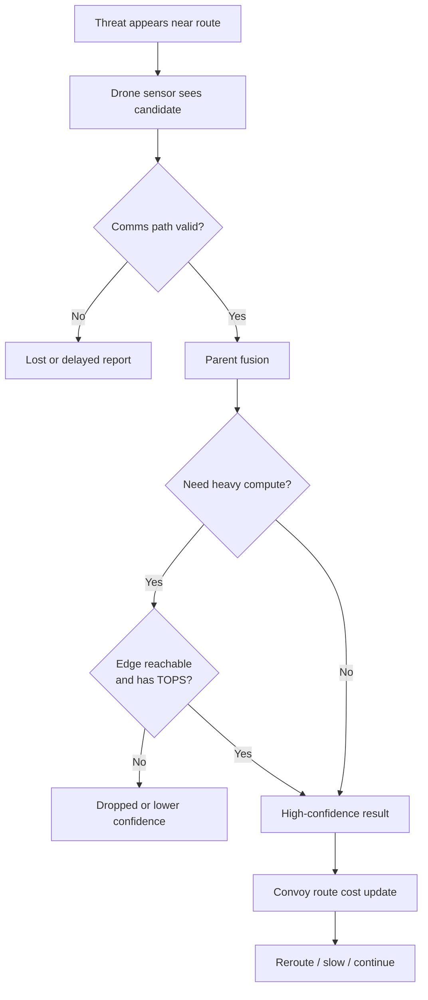
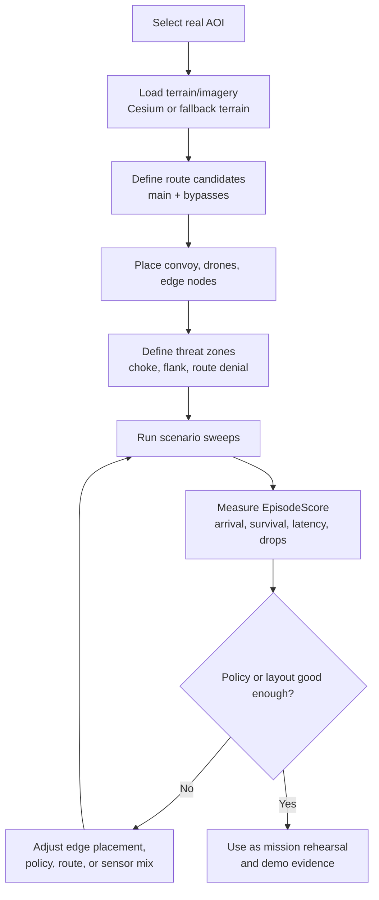

# HADES Realistic Environment And Simulation Design

This document explains how the HADES environment is built to behave like a real-world mission area instead of a toy simulation. It focuses on terrain, route planning, Cesium/Isaac integration, actor placement, live context, latency, compute, battery, attack vectors, and why this environment is a strong way to test whether the HADES drone-edge architecture actually works.

## Purpose

HADES needs a realistic environment because the architecture is only valuable if it survives the conditions that break real drone systems:

- **Roads are not straight lines.**
- **Terrain creates occlusion, route choke points, and radio gaps.**
- **Communications degrade with distance and congestion.**
- **Edge compute is finite and unevenly distributed.**
- **Drone batteries limit coverage time.**
- **Threats appear near route geometry, not random squares.**
- **The convoy must act on incomplete, delayed, and fused information.**

The environment is therefore designed as a mission rehearsal and efficacy-testing system, not just a visual demo.

## Environment Stack

HADES combines real-world geospatial context, OpenUSD assets, Isaac Sim physics, and mission-specific simulation logic.

## Real-World Data Sources

The visual target is **Isaac Sim 6.0** with a Cesium/Omniverse style real-world environment. The environment is not only a hand-built map; it is designed to use geospatial data as the base layer.

- **Cesium terrain and imagery:** The main branch targets Cesium World Terrain and aerial imagery so the simulated route can sit on real geography.
- **OpenUSD stage:** Isaac/Omniverse uses USD assets for drones, convoy vehicles, terrain, and edge nodes.
- **Route geometry:** The route is defined as real scene-local waypoints, not just abstract grid cells.
- **Terrain fallback:** Generated satellite/heightmap terrain remains useful when Cesium streaming or tokens are unavailable.
- **Public context hooks:** The current HADES branch can enrich route/elevation data with public context such as Open-Meteo weather and OpenStreetMap/Overpass-style map features when enabled.
- **Repeatable local cache:** Once terrain, imagery, or generated assets are available, the same scenario can be replayed for tests, training, and demos.

Important wording: Cesium provides streamed real-world terrain and imagery. Dynamic operational conditions such as threats, latency, compute pressure, battery drain, and route denial are simulated by HADES on top of that world model.

## Area Of Operations

The planned primary mission area is the **Laughlin/Bullhead City corridor** around the Arizona/Nevada border.

| Field | Value |
|---|---|
| Center latitude | `35.1700` |
| Center longitude | `-114.5700` |
| Area of interest | `1500 m x 1500 m` |
| Route length target | `1200 m` |
| Update rate | `10 Hz` sim frames |
| Primary mission | Convoy escort through threat-aware route choices |

Three route choices are modeled:

| Route | Character | Risk model |
|---|---|---|
| `main` | Direct route through central choke | Fast but exposed |
| `north_bypass` | Longer bypass with partial cover | Safer when central choke is threatened |
| `south_bypass` | Alternate industrial approach | Useful when north or main route is degraded |

Threat zones:

| Zone | Purpose |
|---|---|
| `choke_a` | Central bridge/chokepoint threat area |
| `flank_b` | Bypass-entry threat area |

## Actor Placement And Roles

The scene uses separate actor tiers so the environment tests hierarchy, not just movement.

| Actor | Count | Environment role |
|---|---:|---|
| **Parent drones** | 2 | High-level relay, heavier perception, compute scheduler, swarm coordinator |
| **Child drones** | 6 | Scout, detect, maintain coverage, relay reports |
| **Static edge nodes** | 18 | Passive compute servers placed along route/network geometry |
| **Convoy vehicles** | 2 | Protected assets that receive intelligence and route directives |

Key realism rule: **only drones carry sensors**. Edge nodes and convoy vehicles do not magically detect threats. They can only act on reports, compute jobs, and route directives that arrive through valid links.

## Realism Layers

The simulation is lifelike because multiple realism layers are active at the same time.

| Layer | What is simulated | Why it matters |
|---|---|---|
| **Geography** | Real corridor, road choices, terrain, chokepoints | Route decisions depend on place |
| **Physics** | Isaac drone/vehicle motion and scene scale | Movement costs and positioning matter |
| **Sensing** | RGB, depth, thermal, LiDAR, IMU target plan | The swarm must perceive, not assume |
| **Comms** | Range, link quality, LoRa/WiFi rules, latency | Network failure changes decisions |
| **Compute** | TOPS budgets, offload targets, dropped jobs | AI inference is not free |
| **Battery** | Per-drone energy pressure and losses | Coverage must be efficient |
| **Threats** | Chokepoints, flanks, confidence, detection | Route safety is dynamic |
| **Scoring** | Arrival, survival, latency, drops, reroutes | Success is measurable |

## Communications Realism

The environment simulates radio and network behavior through `CommsGraph`.

- **WiFi mesh:** Shorter range, used for mesh, edge, and convoy-edge links.
- **LoRa:** Longer range for child-parent and parent-parent reachability.
- **Forbidden direct path:** Child drones cannot send directly to static edge nodes.
- **Link quality:** Drops with distance and is severed below the threshold.
- **Latency:** Increases with active-link congestion and distance.
- **Relay paths:** Multi-hop paths exist only when graph connectivity allows them.

This matters because a policy that works under perfect communications can fail when:

- A child drone drifts outside parent range.
- A parent cannot reach an edge node over WiFi.
- Relay links become congested.
- Detection arrives too late to reroute.
- The convoy is near a threat before confidence is high enough.

## Compute Realism

The environment treats AI inference as a scarce resource.

| Tier | Compute capacity | Expected behavior |
|---|---:|---|
| **Child drone** | `0.5 TOPS` | Lightweight local tasks only |
| **Parent drone** | `100 TOPS` | Local detection, fusion, planning, child offload support |
| **Static edge node** | `50 TOPS` | Heavy inference if reachable |
| **Convoy edge** | Edge-class fallback | Last-resort compute if reachable |

The environment records compute events with:

- Source actor.
- Task name.
- TOPS required.
- Scheduled target.
- Latency.
- Dropped/completed flag.

This allows tests to measure whether the architecture is truly using edge compute effectively.

## Battery And Endurance Realism

Battery is modeled as a mission constraint rather than a cosmetic field.

- **Movement consumes endurance.**
- **Wasteful scouting can reduce late-episode coverage.**
- **Relay positioning can be more valuable than chasing every detection.**
- **Low-battery drones can become mission liabilities.**
- **Reward terms penalize battery drain and drone loss.**

Good policies should learn that the best action is not always maximum movement. Sometimes the best action is to hold a relay position, preserve altitude, keep a parent link open, or let another drone take the scouting task.

## Threat And Attack Vector Realism

HADES models defensive threat conditions at the mission layer.

- **Route denial:** A threat near a chokepoint increases the cost of the direct route.
- **Flank pressure:** Threats near bypass entries force the router to reconsider alternatives.
- **Delayed detection:** Late or low-confidence detections can be operationally useless.
- **Lost custody:** If drones fail to reacquire a track, confidence should decay.
- **Comms degradation:** Link loss can prevent a real detection from reaching the parent or convoy.
- **Compute saturation:** A true detection can be delayed or dropped if compute is overloaded.
- **Edge failure:** Static nodes can be unreachable, overloaded, or marked dead.
- **Partial observability:** No single actor has total ground truth.

## Live Planning Workflow

The realistic environment supports a planning loop that starts with a real location and ends with measurable mission results.

Examples of questions the environment can answer:

- **Where should edge nodes be placed to reduce detection latency?**
- **How many child drones are needed for useful route coverage?**
- **Which route is safest when the central choke is threatened?**
- **How sensitive is success to battery limits?**
- **Does LoRa reachability compensate for WiFi edge gaps?**
- **When does compute offload help, and when does it add too much delay?**
- **Which policy fails gracefully under drone or edge-node loss?**

## Why This Is A Strong Efficacy Test

HADES is a good efficacy test because it ties mission success to the same factors that matter outside the simulator.

- **Real-world geography:** The route and terrain have realistic spatial structure.
- **No perfect information:** The convoy and edge nodes only know what drones report.
- **No infinite compute:** Inference must fit actor budgets or be offloaded legally.
- **No perfect network:** Links have range, quality, latency, and congestion.
- **No free motion:** Battery and drone loss affect mission score.
- **No single success metric:** The system must balance safety, speed, detection, relay, and compute.
- **Repeatable stress testing:** The same mission can be replayed with different failures, policies, and layouts.

That combination makes the HADES environment useful for testing whether a drone-edge autonomy concept is operationally credible, not merely visually impressive.

## Implementation Map

Primary environment files and scripts:

| Path | Role |
|---|---|
| `plan.md` | Defines target route, actor, sensor, compute, and training design |
| `isaac/scene.usda` | Active Isaac/OpenUSD stage |
| `isaac/load_scene.py` | Loads actor layout and route geometry |
| `scripts/record_cesium_demo.py` | Records Cesium/Isaac visual demo |
| `scripts/fetch_terrain.py` | Fetches/generated fallback terrain assets |
| `scripts/build_terrain_usd.py` | Builds/patches terrain USD fallback |
| `hades/config.py` | Shared actor counts, ranges, compute, route values |
| `hades/state.py` | Simulation frame state contract |
| `bridge/sim_publisher.py` | Generates 10 Hz frames for bridge/demo/test use |

## Summary

The HADES realistic environment is a real-world, constraint-driven simulation layer. It uses Cesium/Isaac-style terrain and imagery for physical context, then adds the mission constraints that determine whether the architecture works: latency, compute, link quality, battery, sensor fusion, route denial, and scored convoy outcomes.

The result is a lifelike proving ground for drone swarm protection and humanitarian/public-safety route support.

